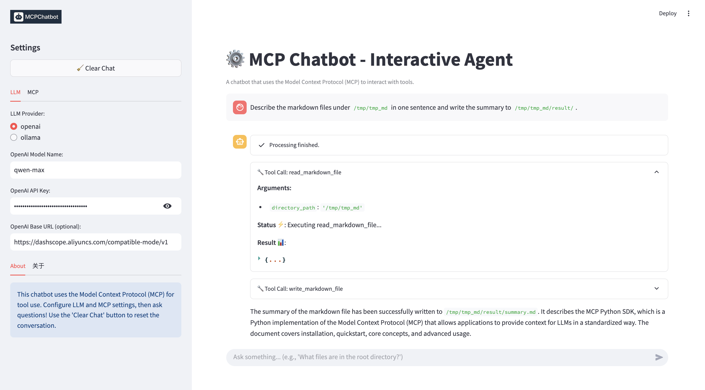

# MCPChatbot 示例


本项目演示了如何将模型上下文协议（Model Context Protocol，MCP）与定制化 LLM（例如 Qwen）集成，创建一个能够通过 MCP 服务器与各种工具交互的强大聊天机器人。该实现展示了 MCP 的灵活性，使大型语言模型能够无缝使用外部工具。

> [!TIP]
> 更多详情，请参阅[英文版 README](README.md)。

## 概述

**Chatbot Streamlit Example**


**Workflow Tracer Example**


- 🚩 Update (2025-04-11):
  - 添加了 Streamlit 聊天机器人示例。
- 🚩 Update (2025-04-10): 
  - 更复杂的 LLM 响应解析，支持多个 MCP 工具调用和多个聊天迭代。
  - 添加了单一提示示例，支持常规模式和流式模式。
  - 添加了交互式终端聊天机器人示例。

本项目包括：

- 简单/复杂命令行聊天机器人界面
- 通过 MCP 集成一些内置的 MCP 服务器（例如 Markdown 处理工具）
- 支持定制化 LLM（例如 Qwen）和 Ollama
- 提供单一提示处理的示例脚本，包括常规模式和流式模式
- 交互式终端聊天机器人，支持常规和流式响应模式

## 系统要求

- Python 3.10+
- 依赖项（通过安装要求自动安装）：
  - python-dotenv
  - mcp[cli]
  - openai
  - colorama

## 安装步骤

1. **克隆仓库：**

   ```bash
   git clone git@github.com:keli-wen/mcp_chatbot.git
   cd mcp_chatbot
   ```

2. **设置虚拟环境（推荐）：**

   ```bash
   cd folder
   
   # Install uv if you don't have it already
   pip install uv

   # Create a virtual environment and install dependencies
   uv venv .venv --python=3.10

   # Activate the virtual environment
   # For macOS/Linux
   source .venv/bin/activate
   # For Windows
   .venv\Scripts\activate

   # Deactivate the virtual environment
   deactivate
   ```

3. **安装依赖：**

   ```bash
   pip install -r requirements.txt
   # or use uv for faster installation
   uv pip install -r requirements.txt
   ```

4. **配置环境：**
   - 复制 `.env.example` 文件到 `.env`：

     ```bash
     cp .env.example .env
     ```

   - 编辑 `.env` 文件以添加你的通义千问 API 密钥并设置路径：

     ```
     LLM_MODEL_NAME=你的LLM模型名称
     LLM_BASE_URL=你的LLM API地址
     LLM_API_KEY=你的LLM API密钥
     OLLAMA_MODEL_NAME=你的ollama模型名称
     OLLAMA_BASE_URL=你的ollama API地址
     MARKDOWN_FOLDER_PATH=/你的/markdown/文件夹/路径
     RESULT_FOLDER_PATH=/你的/结果/文件夹/路径
     ```

## 重要配置说明 ⚠️

在运行应用程序之前，您需要修改以下内容：

1. **MCP 服务器配置**：
   编辑 `mcp_servers/servers_config.json` 以匹配您的本地设置：

   ```json
   {
       "mcpServers": {
           "markdown_processor": {
               "command": "/您的/uv/路径",
               "args": [
                   "--directory",
                   "/您的/项目/mcp_servers/路径",
                   "run",
                   "markdown_processor.py"
               ]
           }
       }
   }
   ```

   将 `/您的/uv/路径` 替换为您系统中 uv 可执行文件的实际路径。
   将 `/您的/项目/mcp_servers/路径` 替换为您项目中 mcp_servers 目录的绝对路径。

2. **环境变量**：
   确保在 `.env` 文件中设置正确的路径：

   ```
   MARKDOWN_FOLDER_PATH="/您的/markdown/文件夹/路径"
   RESULT_FOLDER_PATH="/您的/结果/文件夹/路径"
   ```

   应用程序会验证这些路径，如果它们包含占位符值，将会抛出错误。

你可以通过运行：

```bash
bash scripts/check.sh
```

来检查您的配置是否正确。

## 使用方法

### 单元测试

我添加了一些非常简单的单元测试，你可以通过：

```bash
bash scripts/unittest.sh
```

来运行它们。

### 示例

#### 单一提示示例

项目包含两个单一提示示例：

1. **常规模式**：处理单一提示并显示完整响应
   ```bash
   python example/single_prompt/single_prompt.py
   ```

2. **流式模式**：处理单一提示并提供实时流式输出
   ```bash
   python example/single_prompt/single_prompt_stream.py
   ```

两个示例都接受可选的 `--llm` 参数来指定要使用的 LLM 提供者：
```bash
python example/single_prompt/single_prompt.py --llm=ollama
```

> [!NOTE]
> 更多详情，请参阅[单一提示示例 README](example/single_prompt/README_ZH.md)。

#### 终端聊天机器人示例

项目包含两个交互式终端聊天机器人示例：

1. **常规模式**：带有完整响应的交互式终端聊天
   ```bash
   python example/chatbot_terminal/chatbot_terminal.py
   ```

2. **流式模式**：带有流式响应的交互式终端聊天
   ```bash
   python example/chatbot_terminal/chatbot_terminal_stream.py
   ```

两个示例都接受可选的 `--llm` 参数来指定要使用的 LLM 提供者：
```bash
python example/chatbot_terminal/chatbot_terminal.py --llm=ollama
```

两个示例都接受可选的 `--no-workflow` 参数来隐藏工作流程跟踪：
```bash
python example/chatbot_terminal/chatbot_terminal.py --no-workflow
```

> [!NOTE]
> 更多详情，请参阅[终端聊天机器人示例 README](example/chatbot_terminal/README_ZH.md)。

#### Streamlit Web 聊天机器人示例

项目包含一个使用 Streamlit 的交互式 Web 聊天机器人示例：

```bash
streamlit run example/chatbot_streamlit/app.py
```

该示例具有以下特点：
- 交互式聊天界面。
- 实时流式响应。
- 详细的 MCP 工具工作流可视化。
- 可通过侧边栏配置 LLM 设置（OpenAI/Ollama）和 MCP 工具显示。



> [!NOTE]
> 更多详情，请参阅[Streamlit 聊天机器人示例 README](example/chatbot_streamlit/README_ZH.md)。

</details>

## 项目结构

- `mcp_chatbot/`：核心库代码
  - `chat/`：聊天会话管理
  - `config/`：配置处理
  - `llm/`：LLM 客户端实现
  - `mcp/`：MCP 客户端和工具集成
  - `utils/`：实用工具（例如 `WorkflowTrace` 和 `StreamPrinter`）
- `mcp_servers/`：自定义 MCP 服务器实现
  - `markdown_processor.py`：处理 Markdown 文件的服务器
  - `servers_config.json`：MCP 服务器配置
- `data-example/`：用于测试的示例 Markdown 文件
- `example/`：不同用例的示例脚本
  - `single_prompt/`：单一提示处理示例（常规和流式）
  - `chatbot_terminal/`：交互式终端聊天机器人示例（常规和流式）
  - `chatbot_streamlit/`：使用 Streamlit 的交互式 Web 聊天机器人示例

## 扩展项目

您可以通过以下方式扩展此项目：

1. 在 `mcp_servers/` 目录中添加新的 MCP 服务器
2. 更新 `servers_config.json` 以包含您的新服务器
3. 在现有服务器中实现新功能
4. 基于提供的模板创建新的示例

## 故障排除

- **路径问题**：确保配置文件中的所有路径都是适合您系统的绝对路径
- **MCP 服务器错误**：确保工具已正确安装和配置
- **API 密钥错误**：验证您的 API 密钥在 `.env` 文件中设置正确
